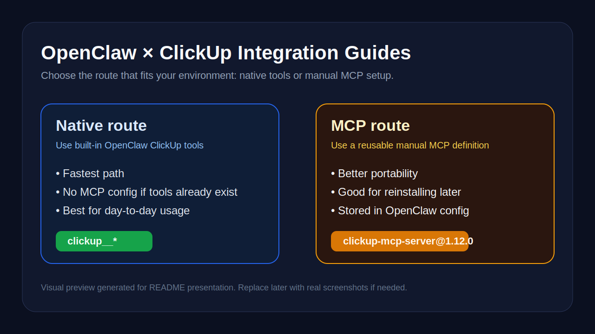

# OpenClaw × ClickUp Integration Guides

This is the **front door** for using **ClickUp with OpenClaw**.

If you only want one page that explains which path to choose, where the docs live, and where the downloadable ZIP releases are, start here.

## Two routes, one goal

### 1) Native route
Use this when your OpenClaw runtime already exposes tools like `clickup__get_workspaces`, `clickup__create_task`, and related `clickup__*` operations.

**Best for:**
- the fastest setup
- the fewest moving parts
- environments where ClickUp tools already work

**Repo:**
- <https://github.com/muhamadbasim/openclaw-clickup-native-integration>

### 2) MCP route
Use this when you want a reusable manual ClickUp integration stored in OpenClaw config.

**Best for:**
- reinstalling later from GitHub
- portable documentation
- explicit MCP configuration you can inspect and reapply

**Repo:**
- <https://github.com/muhamadbasim/integration-to-clickup-with-mcp>

## Which route should you pick?

| Situation | Recommended route |
| --- | --- |
| Native `clickup__*` tools already exist in your runtime | Native |
| You want the simplest day-to-day workflow | Native |
| You want a reusable manual setup saved in config | MCP |
| You want a GitHub tutorial for reinstalling later | MCP |

## Visual previews

### Native route preview

### MCP route preview

## Repository map

### `openclaw-clickup-native-integration`
A guide for the **native OpenClaw ClickUp tool path**.

It documents:
- what native tools were tested
- example outputs
- a practical workflow for creating tasks, comments, and checklists
- when to prefer the native path over MCP

Repo:
- <https://github.com/muhamadbasim/openclaw-clickup-native-integration>

### `integration-to-clickup-with-mcp`
A guide for the **manual MCP path** using `clickup-mcp-server@1.12.0` and `CLICKUP_API_TOKEN`.

It documents:
- quick install and uninstall
- saved MCP config shape
- verification output
- security notes for API tokens

Repo:
- <https://github.com/muhamadbasim/integration-to-clickup-with-mcp>

## Quick comparison

| Topic | Native route | MCP route |
| --- | --- | --- |
| Setup complexity | Lower | Medium |
| Extra config needed | No, if tools already exist | Yes |
| Portability | Lower | Higher |
| Best for | Immediate use | Reusable setup |
| Main reference | `openclaw-clickup-native-integration` | `integration-to-clickup-with-mcp` |

## Start here in 30 seconds

1. Check whether your OpenClaw runtime already exposes `clickup__*` tools.
2. If yes, go straight to the **native guide**.
3. If not, or if you want a reusable config-based setup, use the **MCP guide**.
4. If you just want download links, use the release section below.

## Direct links

- Native guide: <https://github.com/muhamadbasim/openclaw-clickup-native-integration>
- MCP guide: <https://github.com/muhamadbasim/integration-to-clickup-with-mcp>
- Index repo: <https://github.com/muhamadbasim/openclaw-clickup-integration-guides>

## ZIP downloads

- Index repo ZIP: <https://github.com/muhamadbasim/openclaw-clickup-integration-guides/releases/latest>
- Native route ZIP: <https://github.com/muhamadbasim/openclaw-clickup-native-integration/releases/latest>
- MCP route ZIP: <https://github.com/muhamadbasim/integration-to-clickup-with-mcp/releases/latest>

## License

MIT
